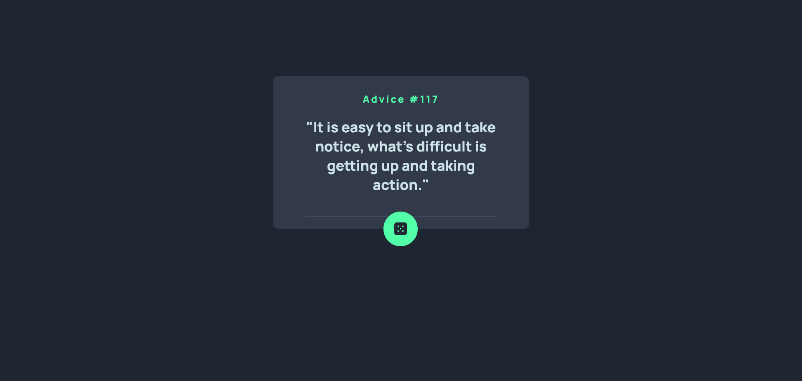

# Frontend Mentor - Advice generator app solution

This is a solution to the [Advice generator app challenge on Frontend Mentor](https://www.frontendmentor.io/challenges/advice-generator-app-QdUG-13db). Frontend Mentor challenges help you improve your coding skills by building realistic projects.

## Table of contents

- [Overview](#overview)
  - [The challenge](#the-challenge)
  - [Screenshot](#screenshot)
  - [Links](#links)
- [My process](#my-process)
  - [Built with](#built-with)
  - [What I learned](#what-i-learned)
- [Author](#author)

## Overview

### The challenge

Users should be able to:

- View the optimal layout for the app depending on their device's screen size
- See hover states for all interactive elements on the page
- Generate a new piece of advice by clicking the dice icon

### Screenshot




### Links

- Solution URL: [GitHub](https://github.com/TomyAlberdi/Advice-Generator-App)
- Live Site URL: [Live Site](https://tomyalberdi.github.io/Advice-Generator-App/)

## My process

### Built with

- Sass
- Flexbox
- Mobile-first workflow
### What I learned

```js
dice.addEventListener('click', async () => {
    let data = await getData()
    renderData(data)
})
let getData = async () => {
    try {
        let info = await fetch(`${endpoint}`)
        info = await info.json()
        return info
    } catch (error) {
        return alert('Error')
    }
}
```

## Author

- Website - [Tomás Alberdi](https://tomyalberdi.github.io/portfolio/)
- Frontend Mentor - [@TomyAlberdi](https://www.frontendmentor.io/profile/TomyAlberdi)